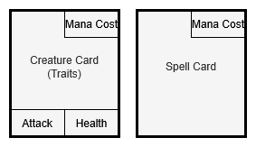

# Milestone 1 - Structure, Config Parsing and Printing
The goal of Milestone 1 is to implement a **basic structure** for the game and create **some of the output** to the console. This includes creating basic classes in an object-oriented structure based on your design document.

## Description Files

- [Design Document - Description of Approach](Design_Document.md)
- Milestone 1 - Structure, Config Parsing and Printing (this file)
- [Milestone 2 - Game and Card Logic](Milestone_2.md)
- [Card Overview](Cards.md) (file listing all cards and their features)
- [Error Overview](Errors.md) (file listing all errors that must be handled)

## Game Basics

<details>
<summary><h3>Overview</h3></summary>

The game consists of the following elements:
- a game board, where cards can be placed
- each player's hand cards
- each player's remaining card deck
- a separate graveyard pile for each player


</details>

<details>
<summary><h3>Cards & Mana</h3></summary>

There are two types of cards in the game:
- Creature cards
- Spell cards

Creature cards are placed on the board and later used to battle. Spells cause instantaneous effects for the game in general or for specific creatures.

To play a card the player has to expend mana. How much depends on the card's **mana cost**.

In addition to their mana cost, creatures also have an **attack** attribute, a **health** attribute and can optionally have so-called **traits**, which give the creature additional properties. Each of these has a base value and a current value (e.g. base health vs. current health). When a creature enters a player's hand or the board, its current values are set to its base values.

Spell cards have no additional attributes or traits.




A list of all possible cards can be found in the [card overview](Cards.md). The same card may exist multiple times in 
the game.

Each player has their own mana pool, where their mana is stored. The size of the mana pool increases during the game. Whenever the mana pool is **resized**, it is also **refilled**.

</details>

<details>
<summary><h3> Deck, Drawing & Hand Cards</h3></summary>

Each player has a separate deck of cards that is specified via the game config file and used as a draw pile.

Whenever a player needs to draw a card, a card is removed from the top of their own deck and added to the last position of the player's hand cards. Only cards that are in the player's hand cards can be played by paying their mana cost.

There is no limit to how many hand cards a player can have.

</details>

<details>
<summary><h3>Game Board</h3></summary>

The game board consists of four zones, two for each player. Each player has a **Field Zone** and a **Battle Zone**. Each zone has seven **slots**, which can be empty or hold one creature. Every slot has an ID (1 to 7). Slots sharing the same ID (in the Field and Battle Zones) for both players are called a **lane**.

If you imagine this as the two players sitting across the table from each other, the board would be placed between them like this:


Creature cards that are played are placed in a slot in the player's Field Zone specified by the player. They can then be moved to a slot in the player's Battle Zone (player's choice which), and later be used to battle.

This is described in detail in [Milestone 2](Milestone_2.md).

</details>

<details>
<summary><h3>Battles, Attacker & Defender</h3></summary>

During the game, battles take place using the creatures that have been moved to the players' Battle Zones (see [Milestone 2](Milestone_2.md) > Command: battle). The goal of these battles is to reduce the opposing player's health points to zero.

Each round, one of the players is the Attacker, the other is the Defender. A battle is automatically started after the Attacker and Defender have ended their turns (see [Milestone 2](Milestone_2.md) > Command: done). Who is the Attacker and who is the Defender switches during the course of the game.

Whenever a battle takes place, each creature in the Attacker's Battle Zone starts a fight along their lane. If there is no creature in the slot with the same ID (= same lane) in the Defender's Battle Zone, the Defender is hit by the attack directly and the Defender's health is reduced. If there is a creature within the same lane in the Defender's Battle Zone, the two creatures fight against each other and reduce each other's health. A creature's health is never refilled, unless it has a specific trait (see the [card overview](Cards.md) > Traits > Regenerate) or is healed by a spell (see the [card overview](Cards.md) > Spells > Target Spells).

A creature whose health points are reduced to zero dies, and is moved to its owner's graveyard. If a player's health points are reduced to zero, the game ends and the other player wins.

</details>

<details>
<summary><h3>Rounds, Phases & Turns</h3></summary>

The game takes place over multiple **rounds**. There is a round counter (`<ROUND_NR>`) which starts at `0` and is increased at the start of every round, including the first.

A round consists of two **phases**, the Setup Phase and the Battle Phase.

Each round starts with the Setup Phase. First, it is the Attacker's turn. During their turn, the Attacker executes as many commands as they want, until they are satisfied (see also [Milestone 2](Milestone_2.md) > Command: done). Afterward, the Defender's turn starts, and the Defender can issue as many commands as they want. A detailed description of all commands can be found in [Milestone 2](Milestone_2.md).

After the Defender is done, the Battle Phase starts, in which **every** creature in the Attacker's Battle Zone starts a fight along their lane. For a more detailed description see [Milestone 2](Milestone_2.md) > Battle Phase.

After the battle has been concluded, the next round starts.

The game can end either at the start of a new round or during the Battle Phase (see also Game Goal & End). The program should then move on to the Final Phase (see [Milestone 2](Milestone_2.md) > Final Phase).


</details>

<details>
<summary><h3>Graveyard</h3></summary>

Each player has a separate **graveyard** pile. A creature that is reduced to zero health points dies, and is moved to the graveyard. It is always placed on top of the pile.

Only creatures can be moved to the graveyard. Spells **do not** get sent to the graveyard after being used, but are instead destroyed.

When a creature is moved to the graveyard, all its values stay exactly like they are when it leaves the board.

There are certain cards that can interact with the graveyard (see [card overview](Cards.md) > Spells > Graveyard Spells).

</details>

<details>
<summary><h3>Game Goal & End</h3></summary>

There are three ways the game can end.
1. A player has been reduced to zero health points or below. This player loses, the other player wins. If both players' health points are reduced to equal or smaller than zero in the same fight, the game ends in a tie.
2. A player needs to draw a card, but has no more cards to draw in their deck. This player loses, the other player wins.
3. `<MAX_ROUNDS>` has been exceeded. The player with the highest health points left is the winner. If both players have the same amount of health points, the game ends in a tie.

</details>

## Initialisation

<details>
<summary><h3>Program Start</h3></summary>

The program is started with two command line parameters, the path to the game config file and the path to the message config file.

```sh
/path/to/executable <GAME_CONFIG_FILE> <MESSAGE_CONFIG_FILE>
```

This is an example of a valid program start:
```sh
./a2 configs/m1_game_config.txt configs/message_config.txt
```

If the program is called with

- more or less command line parameters, or
- one or more files that cannot be opened for reading, or
- one or more files that do not start with the correct magic number,

the corresponding error message should be printed and the program should end with the correct return value (see [Return Values and Error Messages](#return-values-and-error-messages)).

The config files are text files. If the config file starts with the correct magic number (the string `MESSAGE\n` for the message config file and the string `GAME\n` for the game config file), you can assume that it is formatted correctly and only contains valid information. Further checks of the file content are not necessary.

</details>


<details>
<summary><h3> Parsing the Game Config File</h3></summary>

The game config file starts with the magic number `GAME\n`. Contained in it are the parameters needed for running the game.

Following the magic number are constants in this order, one in each line:
- `<PLAYER_HEALTH>` - specifies the initial health points of each player
- `<MAX_ROUNDS>` - limits the maximum round count to an upper bound, which ends the game if exceeded
- `<DECK_SIZE>` - defines the number of cards each deck will have, which is the same for both players
- `<MANA_POOL_SIZE>` - defines the mana pool size that both players start with

These constants are followed by an empty line, and two lines containing the two decks for the players (first Player 1's deck, then Player 2's deck). A player deck consists of a list of **card IDs**, separated by semicolons (`;`). Each deck is constructed in the same order as listed in the game config file, meaning the first card appearing in the file will be the card on the top of the deck (the first card to be drawn).

Card IDs are written in uppercase with underscores, and are exactly five characters long.

<details>
<summary>Example</summary>

The following is an example of a valid game config file:

```
GAME\n
5\n
2\n
10\n
0\n
\n
HWOLF;KNGHT;ALCHM;DRAGN;MOBLZ;CLONE;BLOOD;RAPTR;DEVIL;LLICH\n
T_REX;HWOLF;ZOMBI;SHOCK;METOR;MEMRY;FINAL;CURSE;SOLDR;HWOLF\n
```
</details>

</details>

<details>
<summary><h3> Parsing the Message Config File</h3></summary>

The message config file contains most of the needed error, info and description message strings used in the program.

The first line of the file is the magic number `MESSAGE\n`.

All other lines are key-value pairs, separated by a colon (`:`). Each line represents a text that should be printed at certain points in the game. The `<MESSAGE_TEXT>` string should be printed whenever the key `<MESSAGE_KEY>` is referenced in the assignment description.

```text
<MESSAGE_KEY>:<MESSAGE_TEXT>\n
```

Each `<MESSAGE_KEY>`
- is **unique** in the message config file and written in **uppercase with underscores**.
- starts with the type abbreviation followed by an underline and the remaining key.

| Type Abbreviation  | Type        | Printing Prefix             |
|--------------------|-------------|-----------------------------|
|         I          | Info        | <code>[INFO]&nbsp;</code>   |
|         E          | Error       | <code>[ERROR]&nbsp;</code>  |
|         D          | Description | no printing prefix          |

- Whenever a message is printed in the output, it should start with the printing prefix corresponding to its type. Note the trailing spaces!
- The `<MESSAGE_TEXT>` should be printed exactly as it is written in the message config file (meaning **case** / **whitespace** **sensitive**).
- A newline character (`\n`) must be printed at the end of the message.
- Multi-line messages are **not** allowed, and will not be tested.

<details>
<summary>Example</summary>

The message config file could for example look like this:
```
MESSAGE\n
I_NAME_OF_INFO:Information message to the players\n
E_NAME_OF_ERROR:A severe error occurred.\n
D_CARD_ID:This spell card is very powerful!\n
```

Printing these messages should then look like this:
```
[INFO] Information message to the players\n
[ERROR] A severe error occurred.\n
This spell card is very powerful!\n
```
</details>
</details>


## Playing the Game

<details>
<summary><h3> Starting the Game</h3></summary>

First, the welcome message is printed as follows:
```
<D_BORDER_D>
<D_WELCOME>
<D_BORDER_D>
```

The round counter `<ROUND_NR>` starts at `0`. The players' mana pool size starts at the value given in the game config file under `<MANA_POOL_SIZE>`. Each player draws six cards from the top of their deck and adds them to their (previously empty) hand cards. 

Then, the game starts with the first round.

> **Note**: 
> - You can assume that there will always be at least six cards in the players' decks.
> - Remember that any placeholders that start with `<I_...>`, `<E_...>`, or `<D_...>` should be replaced with the printing prefix and the message string corresponding to the given key in the message config file.

</details>

<details>
<summary><h3> Round Start</h3></summary>

When a new round starts, `<ROUND_NR>` is increased by 1. If the round counter is now greater than `<MAX_ROUNDS>`, the game ends immediately (see also [Milestone 2](Milestone_2.md) > Final Phase).

Next, a round header containing the round counter is printed as follows:

```
\n
<D_BORDER_D>
                                         ROUND <ROUND_NR>\n
<D_BORDER_D>
```

In the first round, Player 1 is the Attacker and Player 2 is the Defender. Which player has which role switches after the first round, and every second round after that.

At the beginning of rounds with an **odd** round counter, both players' mana pool size is increased by 1 and both mana pools are completely refilled. 

For example, if `<MANA_POOL_SIZE>` was `0` in the game config file, the rounds look as follows:

| `<ROUND_NR>` | Mana Pool Size | Mana Refill | Attacker | Defender  |
|--------------|----------------|-------------|----------|-----------|
| 1            | 1              | Yes         | P1       | P2        |
| 2            | 1              | No          | P2       | P1        |
| 3            | 2              | Yes         | P2       | P1        |
| 4            | 2              | No          | P1       | P2        |
| 5            | 3              | Yes         | P1       | P2        |
| 6            | 3              | No          | P2       | P1        |
| 7            | 4              | Yes         | P2       | P1        |
| 8            | 4              | No          | P1       | P2        |
| ...          | ...            | ...         | ...      | ...       |

Afterward, the game board is printed as explained under Game Board Printing (see below).

Finally, first the Attacker, then the Defender draws one card from their deck. If a player cannot draw a card because their deck is empty, the game ends immediately (see also [Milestone 2](Milestone_2.md) > Final Phase).


</details>

<details>
<summary><h3> Game Board Printing</h3></summary>

In a full round the game board is printed three times, if printing is active:
- directly after the round header
- at the end of the Attacker's turn (see [Milestone 2](Milestone_2.md) > Command done)
- at the end of the Defender's turn (see [Milestone 2](Milestone_2.md) > Command done)

Initially, the printing of the game board is active, but it can be deactivated (see [Milestone 2](Milestone_2.md) > Command: board). If it is not active, the game board will not be printed at any of the above listed occasions.

The game board output consists of the following sections, in this order:
- Defender Border
- Defender Field Zone
- Border A
- Defender Battle Zone
- Border B
- Attacker Battle Zone
- Border A
- Attacker Field Zone
- Attacker Border

Printing the game board is a combination of printing rows of cards and delimiters. As a general rule each row of cards contains at most seven cards. If any slots are empty the card is replaced with spaces.


<details>
<summary><h3>Borders</h3></summary>

There are four different types of borders, which are printed as follows:

Defender Border:
```
================================== DEFENDER: PLAYER <ID> ===================================\n
```
- `<ID>` is replaced by the ID of the player who is currently the Defender (`1` or `2`).

Attacker Border:
```
================================== ATTACKER: PLAYER <ID> ===================================\n
```
- `<ID>` is replaced by the ID of the player who is currently the Attacker (`1` or `2`).

Border A:
```
<D_BORDER_A>
```

Border B:
```
<D_BORDER_B>
```

</details>

<details>
<summary><h3>Card Printing</h3></summary>

Cards are printed slightly differently depending on if the card is a creature or a spell.

A single creature card is printed in the following format:

```
 _____M<MC>
| <CID> |
| <TRT> |
A<AT>___H<HP>
```

A single spell card is printed in the following format:

```
 _____M<MC>
| <CID> |
|       |
 _______ 
```

where
- `<MC>` is the mana cost of the card, padded to two digits with leading zeros if necessary. If a card has a 
  variable mana cost, print `XX` instead.
- `<CID>` is the ID, _not the name_, of the card. It is always exactly five characters long and written in uppercase.
- `<TRT>` is replaced by a list of the creature's traits. 
  - Each trait is represented by its first letter in uppercase. All traits are explained in the [card overview](Cards.md).
  - Traits are listed in alphabetical order. 
  - At most five traits are listed on the card. If a creature has less than five traits, the rest is filled with spaces (<code>&nbsp;</code>). If a creature has more than five traits, a `+` is printed instead of the fifth trait.
- In case the card is a **spell**, the line <code>&nbsp;_______&nbsp;</code> is printed at the bottom of the card.
- If the card is a **creature**, the lower left and lower right corners are set to its current attack (`<AT>`) and current health (`<HP>`) values, both padded to two digits with leading zeros if necessary.
- `<MC>`, `<AT>`, and `<HP>` will always be displayed as two characters. If a value is greater than 99, `**` should be printed instead.

If multiple cards need to be printed in the same row, they are always separated by three spaces (<code>&nbsp;&nbsp;&nbsp;</code>).

<details>
<summary>Example</summary>

In this example `Clone` shows how spells are printed, while the `Tutor` and the `Snake` show how creatures are printed. The rightmost `Tutor` shows what a creature with more than five traits would look like. The `Snake` shows what a creature with exactly five traits would look like.

```
 _____MXX    _____M04    _____M02   _____M04
| CLONE |   | TUTOR |   | SNAKE |  | TUTOR |
|       |   | CL    |   | BDHTV |  | BCDH+ |
 _______    A05___H04   A02___H01  A08___H04
```
</details>
</details>

<details>
<summary><h3> Field Zone</h3></summary>

A player's Field Zone is printed as a single row of cards. During the game, creature cards are placed in specific slots of the Field Zone (slot ID 1-7) and should be printed in the corresponding position in the output. Slots that do not contain a card should be filled with spaces.

Each line of a Field Zone row starts and ends with a single `F`. Three spaces (<code>&nbsp;&nbsp;&nbsp;</code>) are printed  between the characters of the start-of-row `F` and the first card slot of the row, between the card slots in the row, as well as between the last card slot and the end-of-row `F`.

<details>
<summary>Example</summary>

For example, the output of a player's Field Zone, that contains a creature each in slot 1 and slot 4, could look like this:
```
F    _____M04                _____M04                                                   F\n
F   | TUTOR |               | TUTOR |                                                   F\n
F   | CL    |               | CL    |                                                   F\n
F   A05___H04               A05___H04                                                   F\n
```
</details>
</details>

<details>
<summary><h3> Battle Zone</h3></summary>

A player's Battle Zone is printed almost the same as a player's Field Zone. The only difference is that each line of a Battle Zone row starts and ends with a single `B`.

<details>
<summary>Example</summary>

For example, the output of a player's Battle Zone, that contains a creature each in slot 2 and slot 3, could look like this:
```
B                _____M04    _____M04                                                   B\n
B               | TUTOR |   | TUTOR |                                                   B\n
B               | CL    |   | CL    |                                                   B\n
B               A05___H04   A05___H04                                                   B\n
```
</details>
</details>

<details>
<summary><h3>Example Game Board Output</h3></summary>

By putting all of these sections together in the right order, the output of the game board could for example look like this:
```
================================== DEFENDER: PLAYER 1 ===================================\n
F    _____M04                _____M04                                                   F\n
F   | TUTOR |               | TUTOR |                                                   F\n
F   | CL    |               | CL    |                                                   F\n
F   A05___H04               A05___H04                                                   F\n
===[---------]=[---------]=[---------]=[---------]=[---------]=[---------]=[---------]===\n
B                _____M04    _____M04                                                   B\n
B               | TUTOR |   | TUTOR |                                                   B\n
B               | CL    |   | CL    |                                                   B\n
B               A05___H04   A05___H04                                                   B\n
~~~[~~~ 1 ~~~]~[~~~ 2 ~~~]~[~~~ 3 ~~~]~[~~~ 4 ~~~]~[~~~ 5 ~~~]~[~~~ 6 ~~~]~[~~~ 7 ~~~]~~~\n
B                                        _____M02    _____M02                           B\n
B                                       | SNAKE |   | SNAKE |                           B\n
B                                       | V     |   | V     |                           B\n
B                                       A02___H01   A02___H01                           B\n
===[---------]=[---------]=[---------]=[---------]=[---------]=[---------]=[---------]===\n
F                _____M02                            _____M02                           F\n
F               | SNAKE |                           | SNAKE |                           F\n
F               | V     |                           | V     |                           F\n
F               A02___H01                           A02___H01                           F\n
================================== ATTACKER: PLAYER 2 ===================================\n
```

In this example, Player 1 is currently the Defender, Player 2 is currently the Attacker.

> **Attention:** Printing the same game status for Player 2 as the Defender and Player 1 as the Attacker flips 
> the board vertically. It does not rotate the board, the slot with ID 1 is always on the left.

</details>

</details>

<details>
<summary><h3>Basic Command Handling</h3></summary>

On a player's turn, they can enter commands to display information and affect the game.

#### Prompting the Player for Input

To prompt the player for input on their turn, the following command prompt should be printed:

```
\n
P<ID>> 
```
Here `<ID>` (`1` or `2`) indicates the player whose turn it currently is.

After printing the command prompt (note the trailing space!), the program waits for an input.

<details>
<summary>Example</summary>

```
\n
P1> 
```
</details>

#### Command: quit / EOF

Syntax: `quit` or `EOF` (End of File, not the string "EOF")

This is a special command that terminates the game with the return value `0` without any further output. It should be possible to use this command anytime the program waits for user input. All resources should be freed before termination.

Further commands as well as error handling are described in [Milestone 2](Milestone_2.md).

</details>

## Return Values and Error Messages

After one of these errors is detected, the program should print the error message, free all allocated resources and terminate with the specified return value. If multiple errors occur at the same time, only the one listed highest in the table should be used.

| Return Value  | Description                                                                               | Error Message                           |
|---------------|-------------------------------------------------------------------------------------------|-----------------------------------------|
| 0             | Game finished or was ended using a command.                                               | no error message                        |
| 1             | Memory allocation error.                                                                  | `[ERROR] Not enough memory!\n`          |
| 2             | Wrong number of command line parameters.                                                  | `[ERROR] Wrong number of parameters.\n` |
| 3             | Config file could not be opened for reading, or does not start with correct magic number. | `[ERROR] Invalid file (<FILE_PATH>).\n` |

The variable `<FILE_PATH>` should be replaced by the path passed in as an argument to the program (e.g. `configs/message_config.txt`). If both files encounter an error, the message should be printed only for the game config file.

## Milestone 1 Example

The following example output was created using [m1_game_config.txt](../configs/m1_game_config.txt) and [message_config.txt](../configs/message_config.txt).

<details>
<summary><h4>Example Console Output</h4></summary>

> **Note:** All slots are empty in the beginning, because both players are yet to execute
> a command.

```
=========================================================================================
Welcome to Magical OOPerations. Are you ready to OOPtimize your strategy?
=========================================================================================

=========================================================================================
                                         ROUND 1
=========================================================================================
================================== DEFENDER: PLAYER 2 ===================================
F                                                                                       F
F                                                                                       F
F                                                                                       F
F                                                                                       F
===[---------]=[---------]=[---------]=[---------]=[---------]=[---------]=[---------]===
B                                                                                       B
B                                                                                       B
B                                                                                       B
B                                                                                       B
~~~[~~~ 1 ~~~]~[~~~ 2 ~~~]~[~~~ 3 ~~~]~[~~~ 4 ~~~]~[~~~ 5 ~~~]~[~~~ 6 ~~~]~[~~~ 7 ~~~]~~~
B                                                                                       B
B                                                                                       B
B                                                                                       B
B                                                                                       B
===[---------]=[---------]=[---------]=[---------]=[---------]=[---------]=[---------]===
F                                                                                       F
F                                                                                       F
F                                                                                       F
F                                                                                       F
================================== ATTACKER: PLAYER 1 ===================================

P1> quit
```

</details>
