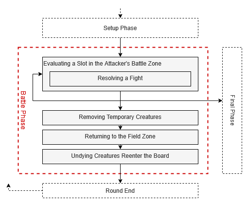

# Milestone 2 - Game and Card Logic

After the basic structure was implemented in Milestone 1, Milestone 2 mostly deals with the **game and card logic**.

## Description Files

- [Design Document - Description of Approach](Design_Document.md)
- [Milestone 1 - Structure, Config Parsing and Printing](Milestone_1.md)
- Milestone 2 - Game and Card Logic (this file)
- [Card Overview](Cards.md) (file listing all cards and their features)
- [Error Overview](Errors.md) (file listing all errors that must be handled)

## Command Handling and Commands Overview

As already mentioned, on a player's turn, they can enter commands to display information and affect the game. The same player is prompted for a new command until they enter a `done` command. Depending on the calling player's role, this then switches to the other player's turn, or starts the Battle Phase.

How the player is prompted for input is described in [Milestone 1](Milestone_1.md).

> **Note**: Remember that all user input should be handled case-insensitively and all additional whitespaces should be ignored (see also [README](../README.md) > General Notes).

<details>
<summary><h3>Command Parameters</h3></summary>

The following table shows types of parameters a command can have and which input values are valid for the corresponding type.

| Variable    | Description                         | Valid Parameter Values                   | Example            |
|-------------|-------------------------------------|------------------------------------------|--------------------|
| `<CARD_ID>` | the ID of a card                    | an ID from the [card overview](Cards.md) | `SNAKE`            |
| `<SLOT>`    | the position of a slot on the board | regex pattern: `O?(F\|B)[1-7]`           | `OF3`, `f1`, `ob7` |

All parameters that include `CARD_ID` in their name count as `<CARD_ID>` parameters (e.g. `<GRAVEYARD_CARD_ID>`, `<HAND_CARD_ID>`). All parameters that include `SLOT` in their name count as `<SLOT>` parameters (e.g. `<FIELD_SLOT>`, `<BATTLE_SLOT>`).

In general, a `<CARD_ID>` parameter must match an ID from the [card overview](Cards.md) to be valid.  It does not matter if the ID is in use in the current game. Further constraints may be listed in the description of certain commands.

A `<SLOT>` parameter describes the position of a slot on the board. It must (case-insensitively) match the regex pattern `O?(F|B)[1-7]`, where
- `O?` (for "opponent") specifies whether the slot is on the player's (`O` not given) or the opponent's (`O` exists) side of the board
- `(F|B)` specifies whether the slot is in the Field (`F`) or Battle Zone (`B`)
- `[1-7]` specifies the slot ID

The whole `<SLOT>` parameter must match the regex pattern to be valid. The parameter is not allowed to contain additional characters.

<details>
<summary>Example</summary>

The following example shows how Player 1, who is currently the Attacker, could target the slots on the board on their turn:

```
================================== DEFENDER: PLAYER 2 ===================================\n
F                                                                                       F\n
F      OF1         OF2         OF3         OF4         OF5         OF6         OF7      F\n
F                                                                                       F\n
F                                                                                       F\n
===[---------]=[---------]=[---------]=[---------]=[---------]=[---------]=[---------]===\n
B                                                                                       B\n
B      OB1         OB2         OB3         OB4         OB5         OB6         OB7      B\n
B                                                                                       B\n
B                                                                                       B\n
~~~[~~~ 1 ~~~]~[~~~ 2 ~~~]~[~~~ 3 ~~~]~[~~~ 4 ~~~]~[~~~ 5 ~~~]~[~~~ 6 ~~~]~[~~~ 7 ~~~]~~~\n
B                                                                                       B\n
B       B1          B2          B3          B4          B5          B6          B7      B\n
B                                                                                       B\n
B                                                                                       B\n
===[---------]=[---------]=[---------]=[---------]=[---------]=[---------]=[---------]===\n
F                                                                                       F\n
F       F1          F2          F3          F4          F5          F6          F5      F\n
F                                                                                       F\n
F                                                                                       F\n
================================== ATTACKER: PLAYER 1 ===================================\n
```
</details>

</details>

<details>
<summary><h3>Invalid Commands Handling</h3></summary>

Whenever a command input is entered, it should be checked for validity. If an error occurs, the corresponding error message with the value of the listed message key is printed. Then print the command prompt (including leading `\n` and the player ID) again. The player should now be able to enter a new command.

An invalid command **should not be executed and does not change the state of the game**.

For each invalid command **only print one error message**. If several errors occur at the same time, only the one that is ranked earliest (lowest Rank number) should be printed. 

The following table lists a general error that may occur for any user input. Additional errors need to be handled for specific commands. These errors are described in the corresponding section, and also use the ranking system.

| Rank | Error Description                   | Message Key         |
|------|-------------------------------------|---------------------|
| 1    | the entered command is not known    | `E_UNKNOWN_COMMAND` |


</details>


## Setup Phase Commands

In this section all commands that can be used by the players during the Setup Phase of the round are described.

> **Note**: Remember that any placeholders that start with `<I_...>`, `<E_...>`, or `<D_...>` should be replaced with the printing prefix and the message string corresponding to the given key in the message config file.

<details>
<summary><h4>Command: quit</h4></summary>

The `quit` command was already described in [Milestone 1](Milestone_1.md).

In addition to the error described in the Invalid Commands Handling section, the following error must be handled for the `quit` command as well:

| Rank | Error Description                                                    | Message Key                    |
|------|----------------------------------------------------------------------|--------------------------------|
| 2    | there are more or less parameters than the given command should have | `E_INVALID_PARAM_COUNT`        |


</details>

<details>
<summary><h4>Command: help</h4></summary>

**Syntax:** `help`

The `help` command prints a list of all available commands.

```
=== Commands ============================================================================\n
- help\n
    Prints this help text.\n
\n
- quit\n
    Terminates the game.\n
\n
- battle <FIELD_SLOT> <BATTLE_SLOT>\n
    Moves a creature from a Field Zone slot into a Battle Zone slot.\n
    <FIELD_SLOT>: Current slot of the creature (F1, ..., F7)\n
    <BATTLE_SLOT>: Battle slot for the creature (B1, ..., B7)\n
\n
- board\n
    Toggles the board printing.\n
\n
- creature <HAND_CARD_ID> <FIELD_SLOT>\n
    Places a creature from your hand into a Field Zone slot.\n
    <HAND_CARD_ID>: The ID of the creature card in your hand\n
    <FIELD_SLOT>: The Field Zone slot to place the creature in\n
\n
- done\n
    Ends your turn for this round.\n
\n
- graveyard\n
    Prints all the cards in your graveyard.\n
\n
- hand\n
    Prints your hand cards.\n
\n
- info <CARD_ID>\n
    Prints card information.\n
    <CARD_ID>: The ID of the card to be inspected\n
\n
- redraw\n
    Discards all hand cards and draws the same amount minus one from your deck.\n
\n
- spell <HAND_CARD_ID> [<TARGET_SLOT>|<GRAVEYARD_CARD_ID>]\n
    Casts a spell from your hand.\n
    <HAND_CARD_ID>: The ID of the spell in your hand\n
    <TARGET_SLOT>: The slot to target with a target spell\n
    <GRAVEYARD_CARD_ID>: The ID of a card in the graveyard to cast a graveyard spell on\n
\n
- status\n
    Prints general information about both players.\n
\n
=========================================================================================\n
```

In addition to the error described in the Invalid Commands Handling section, the following error must be handled:

| Rank | Error Description                                                    | Message Key                    |
|------|----------------------------------------------------------------------|--------------------------------|
| 2    | there are more or less parameters than the given command should have | `E_INVALID_PARAM_COUNT`        |

</details>

<details>
<summary><h4>Command: graveyard</h4></summary>

**Syntax:** `graveyard`

The `graveyard` command prints a list of all cards that are in the current player's graveyard. Only creatures can be in the graveyard. Spells are destroyed after being used.

Printing the graveyard should have the following format:

```
<D_BORDER_GRAVEYARD>
<CARD_LIST>
<D_BORDER_D>
```
with `<CARD_LIST>` being a list of all cards in the current player's graveyard, starting with the most recent one to be moved there.

A card on the `<CARD_LIST>` should have the following format:

```
<CARD_ID> | <CARD_NAME>\n
```
where
- `<CARD_ID>` is the ID of the card and exactly 5 characters long
- `<CARD_NAME>` is the name of the card

If the player's graveyard is empty, `<CARD_LIST>` should be omitted.

> **Attention**: Whenever a creature is moved to a player's graveyard, all its values stay exactly like they are when it leaves the board. A creature's current values are only set to its base values when it enters a player's hand or the board (see the [card overview](Cards.md) for a more detailed explanation).

<details>
<summary>Example</summary>

```
=== Graveyard ===========================================================================\n
TUTOR | Evil Tutor\n
SNAKE | Snake\n
=========================================================================================\n
```

</details>

In addition to the error described in the Invalid Commands Handling section, the following error must be handled:

| Rank | Error Description                                                    | Message Key                    |
|------|----------------------------------------------------------------------|--------------------------------|
| 2    | there are more or less parameters than the given command should have | `E_INVALID_PARAM_COUNT`        |

</details>

<details>
<summary><h4>Command: board</h4></summary>

**Syntax:** `board`

The `board` command enables or disables the game board printing.

Initially the game board printing is enabled. If the game board printing is enabled and the command `board` is entered, it is disabled. Afterward, every time the board would normally be printed, nothing is printed.

If the game board printing is disabled and the command `board` is entered, it is enabled. The board is printed once immediately. Afterward, the game board should be printed as normal whenever it is relevant during the course of the game.

In addition to the error described in the Invalid Commands Handling section, the following error must be handled:

| Rank | Error Description                                                    | Message Key                    |
|------|----------------------------------------------------------------------|--------------------------------|
| 2    | there are more or less parameters than the given command should have | `E_INVALID_PARAM_COUNT`        |

</details>

<details>
<summary><h4>Command: hand</h4></summary>

**Syntax:** `hand`

The `hand` command prints the current player's hand cards, in the following format:

```
<D_BORDER_HAND>
<ROWS_OF_HAND_CARDS>
<D_BORDER_D>
```

For how single cards are printed, see [Milestone_1](Milestone_1.md) > Game Board Printing > Card Printing.

A player's hand cards are printed in rows (`<ROWS_OF_HAND_CARDS>`). The hand cards are always printed from left to right in the order the player received them. Each row of card prints can contain at most seven cards. When a card does not fit into the current row anymore, a new row is started.

A line in a row of cards
- starts with four spaces,
- has three spaces between the edges of the cards in the row, and
- ends immediately after the edge of the last card in the row. 

If the player's hand is empty, `<ROWS_OF_HAND_CARDS>` should be omitted.

> **Attention**: 
> - Whenever a creature enters a player's hand, the creature's current values are set to its base values (see the [card overview](Cards.md) for a more detailed explanation). So this output always shows the cards' base values.
> - Some lines of single cards might start or end in a space, so take care that everything is aligned properly.

<details>
<summary>Example</summary>

```
=== Hand Cards ==========================================================================\n
     _____M04    _____M04    _____M04    _____M04    _____M04    _____M04    _____M04\n
    | TUTOR |   | TUTOR |   | TUTOR |   | TUTOR |   | TUTOR |   | TUTOR |   | TUTOR |\n
    | CL    |   | CL    |   | CL    |   | CL    |   | CL    |   | CL    |   | CL    |\n
    A05___H04   A05___H04   A05___H04   A05___H04   A05___H04   A05___H04   A05___H04\n
     _____MXX    _____MXX\n
    | CLONE |   | CLONE |\n
    |       |   |       |\n
     _______     _______ \n
=========================================================================================\n
```

</details>

In addition to the error described in the Invalid Commands Handling section, the following error must be handled:

| Rank | Error Description                                                    | Message Key                    |
|------|----------------------------------------------------------------------|--------------------------------|
| 2    | there are more or less parameters than the given command should have | `E_INVALID_PARAM_COUNT`        |


</details>


<details>
<summary><h4>Command: info</h4></summary>

**Syntax:** `info <CARD_ID>`

This command prints an information summary for the card with ID `<CARD_ID>`. This should work for any `<CARD_ID>` listed in the [card overview](Cards.md), not only for those in the current game. Additional information about the different features that are listed in the info can be found in the card overview as well.

If the card is a **creature**, the information should have the following format:
```
<D_BORDER_INFO>
<CARD_NAME> [<CARD_ID>] (<MANA_COST> mana)\n
Type: Creature\n
Base Attack: <BASE_ATTACK>\n
Base Health: <BASE_HEALTH>\n
Base Traits: <CARD_TRAITS>\n
<D_BORDER_D>
```
- `<CARD_NAME>` is the name of the card
- `<CARD_ID>` is the ID of the card
- `<MANA_COST>` is the mana cost of the card
- `<BASE_ATTACK>` is the creature's base attack value 
- `<BASE_HEALTH>` is the creature's base health value
- `<BASE_TRAITS>` is an alphabetically sorted list of trait names. The trait names are separated by a comma and a space (`, `), e.g. `Brutal, First Strike, Haste`. If the creature does not have any traits, print `-` instead.

`<MANA_COST>`, `<BASE_ATTACK>`, and `<BASE_HEALTH>` are printed without leading zeros.

If the card is a **spell**, the information should have the following format:
```
<D_BORDER_INFO>
<CARD_NAME> [<CARD_ID>] (<MANA_COST> mana)\n
Type: Spell\n
Effect: <CARD_DESCRIPTION>
<D_BORDER_D>
```
- `<CARD_NAME>` is the name of the card
- `<CARD_ID>` is the ID of the card
- `<MANA_COST>` is the mana cost of the card. If a card has a variable mana cost, print `XX` instead.
- `<CARD_DESCRIPTION>` is the description of the effect of the card as written in the message config file under `D_<CARD_ID>`. E.g. for the Death Curse spell, the value at key `D_CURSE` should be printed.

<details>
<summary>Example</summary>

Creature:
```
=== Card Info ===========================================================================\n
Tutor [TUTOR] (4 mana)\n
Type: Creature\n
Base Attack: 5\n
Base Health: 4\n
Base Traits: Challenger, Lifesteal\n
=========================================================================================\n
```
Spell:
```
=== Card Info ===========================================================================\n
Death Curse [CURSE] (XX mana)\n
Type: Spell\n
Effect: The target creature gains the Temporary trait. This spell's mana cost is equal to the target creature's mana cost plus 1.\n
=========================================================================================\n
```
</details>

In addition to the error described in the Invalid Commands Handling section, the following errors must be handled:

| Rank | Error Description                                                                           | Message Key              |
|------|---------------------------------------------------------------------------------------------|--------------------------|
| 2    | there are more or less parameters than the given command should have                        | `E_INVALID_PARAM_COUNT`  |
| 4    | a given `<CARD_ID>` parameter does not match any of the card IDs in the card overview       | `E_INVALID_CARD`         |

</details>

<details>
<summary><h4>Command: redraw</h4></summary>

**Syntax:** `redraw`

This command lets the player discard their hand cards and draw new cards.

Players may have had bad luck with their starting hand. In order to mitigate the impact of a bad starting hand, each player can run `redraw` as long as they have not yet affected the game state in any way.

Successfully executing any of the following commands disables `redraw` for this player for the rest of the game:
- `done`
- `battle`
- `creature`
- `spell`

When executing a `redraw` command, the player's current hand cards are put on the bottom of their draw pile in the same order in which they drew them. Then the player draws new cards from the top until they have one less card than previously in their hand cards. A player may repeat the `redraw`, however every time one less card is drawn. Once a player has less than two cards in their hand, they are not allowed any further redraws.

In addition to the error described in the Invalid Commands Handling section, the following errors must be handled:

| Rank | Error Description                                                                                                      | Message Key                    |
|------|------------------------------------------------------------------------------------------------------------------------|--------------------------------|
| 2    | there are more or less parameters than the given command should have                                                   | `E_INVALID_PARAM_COUNT`        |
| 6    | the player tries to use `redraw` after it has been disabled                                                            | `E_REDRAW_DISABLED`            |
| 7    | the player tries to use `redraw` with less than two cards in their hand cards                                          | `E_REDRAW_NOT_ENOUGH_CARDS`    |

</details>

<details>
<summary><h4>Command: status</h4></summary>

**Syntax:** `status`

The `status` command prints some general information about the current status of the game, in the following format:

```
<D_BORDER_STATUS>
Player 1\n
Role: <ROLE_P1>\n
Health: <CURRENT_HEALTH_P1>\n
Mana: <CURRENT_MANA_P1> / <CURRENT_MANA_POOL_SIZE>\n
Remaining Deck: <NR_CARDS_REMAINING_P1> card(s)\n
Graveyard Size: <NR_CARDS_IN_GRAVEYARD_P1> card(s)\n
<D_BORDER_C>
Player 2\n
Role: <ROLE_P2>\n
Health: <CURRENT_HEALTH_P2>\n
Mana: <CURRENT_MANA_P2> / <CURRENT_MANA_POOL_SIZE>\n
Remaining Deck: <NR_CARDS_REMAINING_P2> card(s)\n
Graveyard Size: <NR_CARDS_IN_GRAVEYARD_P2> card(s)\n
<D_BORDER_D>
```
where
- `<ROLE_PX>` is the current role of the player (either `Attacker` or `Defender`)
- `<CURRENT_HEALTH_PX>` is the current health value of the player
- `<CURRENT_MANA_PX>` is the mana that is currently still available for that player to pay for cards
- `<CURRENT_MANA_POOL_SIZE>` is the current size of the players' mana pools. Both players' mana pools are always the same size.
- `<NR_CARDS_REMAINING_PX>` is the number of cards remaining in the player's deck, so the number of cards that can still be drawn
- `<NR_CARDS_IN_GRAVEYARD_PX>` is the number of cards currently in the player's graveyard

In addition to the error described in the Invalid Commands Handling section, the following error must be handled:

| Rank | Error Description                                                    | Message Key                    |
|------|----------------------------------------------------------------------|--------------------------------|
| 2    | there are more or less parameters than the given command should have | `E_INVALID_PARAM_COUNT`        |

</details>

<details>
<summary><h4>Command: done</h4></summary>

**Syntax:** `done`

A successful `done` command ends the player's turn.

First, all relevant **trait effects** (see the [card overview](Cards.md) for a list of all traits a creature can have, and their effects) on the player's side of the board are handled. This is done by first going through the player's  Battle Zone slots, and then their Field Zone slots, both by increasing ID. Whenever a creature that fulfills one of the following conditions is encountered, the effect should be applied and the message should be printed. If a creature fulfills multiple conditions, the effects and messages should be handled in the order they appear in the below table from top to bottom.

| Condition                                                                                           | Effect                                                             | Message Key      |
|-----------------------------------------------------------------------------------------------------|--------------------------------------------------------------------|------------------|
| `<ROUND_NR>` is odd, creature has the **Regenerate** trait and less current health than base health | set creature's current health to its base health                   | `<I_REGENERATE>` |
| creature has the **Poisoned** trait                                                                 | creature loses 1 current health (creature might move to graveyard) | `<I_POISONED>`   |


Then, the **game board is printed** (see [Milestone 1](Milestone_1.md) > Game Board Printing), if game board printing is enabled.

Next, if the command was executed by the Attacker, the Defender starts their turn in the Setup Phase and is prompted for input. If the command was executed by the Defender, the Setup Phase ends and the [Battle Phase](#battle-phase) starts.

In addition to the error described in the Invalid Commands Handling section, the following error must be handled:

| Rank | Error Description                                                    | Message Key                    |
|------|----------------------------------------------------------------------|--------------------------------|
| 2    | there are more or less parameters than the given command should have | `E_INVALID_PARAM_COUNT`        |


</details>

<details>
<summary><h4>Command: battle</h4></summary>

**Syntax:** `battle <FIELD_SLOT> <BATTLE_SLOT>`

The `battle` command is used to move a player's own creature from the Field Zone into the Battle Zone. The first parameter corresponds to the Field Zone slot of the creature to be moved, the second parameter corresponds to the Battle Zone slot to move to.

Using the `battle` command, a creature cannot be moved into the Battle Zone in the same round it was played, except if it has the Haste trait.

When successfully executing a `battle` command, first the creature is moved from `<FIELD_SLOT>` to `<BATTLE_SLOT>`. If the moved creature has the **Haste** trait and has entered the board in this round, print `<I_HASTE>`.

Next, if the moved creature has the **Challenger** trait, the opponent's Field Zone slot in the same lane as `<BATTLE_SLOT>` contains a creature, and the opponent's Battle Zone slot in the same lane as `<BATTLE_SLOT>` is empty, move the opponent's creature from the Field Zone slot to the Battle Zone slot. If this moves a creature, print `<I_CHALLENGER>`. For this, it does not matter if the opponent's creature entered the board in the same round.

<details>
<summary>Examples</summary>

In these examples, creatures marked with (C) have the Challenger trait. All examples use the following initial setup:

|                          | Lane 1 | Lane 2 | Lane 3 | Lane 4 | Lane 5 | Lane 6 | Lane 7 |
|--------------------------|--------|--------|--------|--------|--------|--------|--------|
| **Opponent Field Zone**  | A      | B      | C      |        |        |        |        |
| **Opponent Battle Zone** |        | D      |        |        |        | E      |        |
| **Own Battle Zone**      |        |        |        |        |        |        |        |
| **Own Field Zone**       | F(C)   | G      | H(C)   | I(C)   | J      | K      | L      |


<details>
<summary>Example 1: <code>battle f3 b5</code></summary>

|                          | Lane 1 | Lane 2 | Lane 3 | Lane 4 | Lane 5 | Lane 6 | Lane 7 |
|--------------------------|--------|--------|--------|--------|--------|--------|--------|
| **Opponent Field Zone**  | A      | B      | C      |        |        |        |        |
| **Opponent Battle Zone** |        | D      |        |        |        | E      |        |
| **Own Battle Zone**      |        |        |        |        | H(C)   |        |        |
| **Own Field Zone**       | F(C)   | G      |        | I(C)   | J      | K      | L      |

`<I_CHALLENGER>` is not printed, because no creature was moved due to the challenge.

</details>

<details>
<summary>Example 2: <code>battle f3 b2</code></summary>

|                          | Lane 1 | Lane 2 | Lane 3 | Lane 4 | Lane 5 | Lane 6 | Lane 7 |
|--------------------------|--------|--------|--------|--------|--------|--------|--------|
| **Opponent Field Zone**  | A      | B      | C      |        |        |        |        |
| **Opponent Battle Zone** |        | D      |        |        |        | E      |        |
| **Own Battle Zone**      |        | H(C)   |        |        |        |        |        |
| **Own Field Zone**       | F(C)   | G      |        | I(C)   | J      | K      | L      |

`<I_CHALLENGER>` is not printed, because no creature was moved due to the challenge.

</details>

<details>
<summary>Example 3: <code>battle f3 b1</code></summary>

|                          | Lane 1 | Lane 2 | Lane 3 | Lane 4 | Lane 5 | Lane 6 | Lane 7 |
|--------------------------|--------|--------|--------|--------|--------|--------|--------|
| **Opponent Field Zone**  |        | B      | C      |        |        |        |        |
| **Opponent Battle Zone** | A      | D      |        |        |        | E      |        |
| **Own Battle Zone**      | H(C)   |        |        |        |        |        |        |
| **Own Field Zone**       | F(C)   | G      |        | I(C)   | J      | K      | L      |

`<I_CHALLENGER>` is printed, because creature A was moved due to the challenge.

</details>
</details>

In addition to the error described in the Invalid Commands Handling section, the following errors must be handled:

| Rank | Error Description                                                                                    | Message Key                   |
|------|------------------------------------------------------------------------------------------------------|-------------------------------|
| 2    | there are more or less parameters than the given command should have                                 | `E_INVALID_PARAM_COUNT`       |
| 5    | a given `<SLOT>` parameter does not match the slot regex pattern `O?(F\|B)[1-7]`                     | `E_INVALID_SLOT`              |
| 12   | `<FIELD_SLOT>` is not in the player's own Field Zone                                                 | `E_NOT_IN_FIELD`              |
| 13   | `<FIELD_SLOT>` does not contain a creature                                                           | `E_FIELD_EMPTY`               |
| 14   | the creature in `<FIELD_SLOT>` entered the board in the same round and does not have the Haste trait | `E_CREATURE_CANNOT_BATTLE`    |
| 15   | `<BATTLE_SLOT>` is not in the player's own Battle Zone                                               | `E_NOT_IN_BATTLE`             |
| 16   | `<BATTLE_SLOT>` already contains a creature                                                          | `E_BATTLE_OCCUPIED`           |

</details>

<details>
<summary><h4>Command: creature</h4></summary>

**Syntax:** `creature <HAND_CARD_ID> <FIELD_SLOT>`

The `creature` command places a creature from the player's hand cards into the player's chosen slot. The slot must be in the player's own Field Zone. If the player has multiple cards with the same `<HAND_CARD_ID>` in their hand, the one that has been added to their hand cards earliest should be played.

When a `creature` command is successfully executed, the creature card is removed from the player's hand cards and enters the board, the info message of the creature with the key `I_<CARD_ID>` is printed (e.g. when playing a `TUTOR`, `<I_TUTOR>` should be printed) and the player's available mana is reduced by the mana cost of the card.

> **Attention**: Whenever a creature enters the board, the creature's current values are set to its base values (see the [card overview](Cards.md) for a more detailed explanation).

In addition to the error described in the Invalid Commands Handling section, the following errors must be handled:

| Rank | Error Description                                                                     | Message Key             |
|------|---------------------------------------------------------------------------------------|-------------------------|
| 2    | there are more or less parameters than the given command should have                  | `E_INVALID_PARAM_COUNT` |
| 4    | a given `<CARD_ID>` parameter does not match any of the card IDs in the card overview | `E_INVALID_CARD`        |
| 5    | a given `<SLOT>` parameter does not match the slot regex pattern `O?(F\|B)[1-7]`      | `E_INVALID_SLOT`        |
| 8    | `<HAND_CARD_ID>` is not present in the player's hand cards                            | `E_NOT_IN_HAND`         |
| 9    | `<HAND_CARD_ID>` is not a creature                                                    | `E_NOT_CREATURE`        |
| 12   | `<FIELD_SLOT>` is not in the player's own Field Zone                                  | `E_NOT_IN_FIELD`        |
| 17   | `<FIELD_SLOT>` already contains a creature                                            | `E_FIELD_OCCUPIED`      |
| 21   | not enough mana to play this card                                                     | `E_NOT_ENOUGH_MANA`     |

</details>

<details>
<summary><h4>Command: spell</h4></summary>

**Syntax:** `spell <HAND_CARD_ID> <OPTIONAL_ADDITIONAL_PARAMETER>`

The `spell` command plays a spell card from the player's hand. Spell cards cause an instantaneous effect and are destroyed afterward. Spell cards never move to the graveyard. If the player has multiple cards with the same `<HAND_CARD_ID>` on their hand, the one that has been added to their hand cards earliest should be played.

When a `spell` command is successfully executed, the spell's effect is applied, the info message of the spell with the key `I_<CARD_ID>` is printed (e.g. when playing a `CURSE`, `<I_CURSE>` should be printed) and the player's available mana is reduced by the mana cost of the card.

There are three different subtypes of spells:
- General Spells
- Target Spells
- Graveyard Spells

All spells need the `<HAND_CARD_ID>` of the card to be played as a parameter. Depending on the subtype, a single `<OPTIONAL_ADDITIONAL_PARAMETER>` may exist or not. So in total a `spell` command may have one or two parameters.

> **Attention**:
> - The `spell` command is the only command that cannot be checked for the basic `E_INVALID_PARAM_COUNT` error, because  the correct number of parameters depends on the subtype of the spell.
> - Whenever a spell causes a creature to enter the board or a player's hand, the creature's current values are set to its base values (see the [card overview](Cards.md) for a more detailed explanation). Additional effects may be applied afterward.

In addition to the error described in the Invalid Commands Handling section, the following errors must be handled for **all** spells:

| Rank | Error Description                                                                                                      | Message Key                   |
|------|------------------------------------------------------------------------------------------------------------------------|-------------------------------|
| 3    | the `spell` command has zero parameters                                                                                | `E_MISSING_CARD`              |
| 4    | a given `<CARD_ID>` parameter does not match any of the card IDs in the card overview                                  | `E_INVALID_CARD`              |
| 8    | `<HAND_CARD_ID>` is not present in the player's hand cards                                                             | `E_NOT_IN_HAND`               |
| 10   | `<HAND_CARD_ID>` is not a spell                                                                                        | `E_NOT_SPELL`                 |
| 11   | the `spell` command does not have exactly the amount of parameters needed for `<HAND_CARD_ID>`'s subtype               | `E_INVALID_PARAM_COUNT_SPELL` |
| 21   | not enough mana to play this card                                                                                      | `E_NOT_ENOUGH_MANA`           |

### General Spells

**Syntax:** `spell <HAND_CARD_ID>`

These spells have general effects and need exactly one parameter.  A list of all General Spells and their effects can be found in the [card overview](Cards.md).


### Target Spells

**Syntax:** `spell <HAND_CARD_ID> <TARGET_SLOT>`

These spells target a single slot containing a creature on the board and need exactly two parameters. The effect of the spell is added to the specified creature. A list of all Target Spells and their effects can be found in the [card overview](Cards.md).

All Target Spells can target any creature on the board. If a spell would not have any or only a partial effect (e.g. adding a trait to a creature that already has that trait), the spell is still executed like normal.

In addition to the error described in the Invalid Commands Handling section, and the errors which must be handled for all spells, the following errors must be handled for Target Spells:

| Rank | Error Description                                                       | Message Key                    |
|------|-------------------------------------------------------------------------|--------------------------------|
| 18   | `<TARGET_SLOT>` does not match the slot regex pattern `O?(F\|B)[1-7]`   | `E_INVALID_SLOT_SPELL`         |
| 19   | `<TARGET_SLOT>` does not contain a creature                             | `E_TARGET_EMPTY`               |


### Graveyard Spells

**Syntax:** `spell <HAND_CARD_ID> <GRAVEYARD_CARD_ID>`

These spells target a single creature card in the player's own graveyard and need exactly two parameters. A list of all Graveyard Spells and their effects can be found in the [card overview](Cards.md).

If the player has multiple cards with the same `<GRAVEYARD_CARD_ID>` in their graveyard, the one has been moved to the graveyard most recently should be chosen.

In addition to the error described in the Invalid Commands Handling section, and the errors which must be handled for all spells, the following errors must be handled for Graveyard Spells:

| Rank | Error Description                                                           | Message Key                  | 
|------|-----------------------------------------------------------------------------|------------------------------|
| 20   | `<GRAVEYARD_CARD_ID>` does not match any card ID in the player's graveyard  | `E_NOT_IN_GRAVEYARD`         |

</details>

## Battle Phase

After the Defender has ended their turn with `done`, the Setup Phase ends and the Battle Phase starts.

<details>
<summary><h3>Battle Phase Sequence</h3></summary>

First, print the header for the Battle Phase as follows:
```
\n
<D_BORDER_BATTLE_PHASE>
```

During the Battle Phase, each slot in the Attacker's Battle Zone is evaluated in increasing order by slot ID.

Before a slot is evaluated, always print the following header:
```
---------------------------------------- SLOT <ID> -----------------------------------------\n
```

where
- `<ID>` is the ID of the slot (`1` to `7`)

If the slot is empty, nothing happens and the evaluation moves on to the next slot. If the slot contains a creature, a fight happens (see Resolving a Fight).

After **all** slots in the Attacker's Battle Zone have been evaluated, `<D_BORDER_BATTLE_END>` is printed. Then, all surviving creatures on the board with the Temporary trait are moved to the owner's graveyard. Then, all remaining creatures in both players' Battle Zones return to their respective Field Zone. Next, all creatures with the Undying trait in the graveyard enter the board again.

Finally, the current round ends, and the next round starts as described in [Milestone 1](Milestone_1.md) > Playing the Game > Round Start. Any effects a creature has received during this round (e.g. reduced current health, added or removed traits) carry over into the next round.



</details>

<details>
<summary><h3>Resolving a Fight</h3></summary>

If there is a creature in the Attacker's Battle Zone slot that is being evaluated, a fight starts in that lane.

The following creatures will never be part of a fight:
- creatures in the players' Field Zones
- creatures in the Defender's Battle Zone in a lane where the Attacker's Battle Zone slot is empty

#### Direct Hit

If there is no creature in the same lane in the Defender's Battle Zone, the Defender is hit by the attack directly. `<I_DIRECT>` should be printed and the Defender's health is reduced by the Attacker's creature's current attack. Creature traits are not relevant for a direct hit.

If this reduces the Defender's health to equal or smaller than zero, the game ends immediately and the Attacker wins. The program should move on to the Final Phase instead of evaluating the next slot in the Attacker's Battle Zone or printing any further output in the Battle Phase.

#### Fight Between Two Creatures

If there is a creature within the same lane in the Defender's Battle Zone, the two creatures fight against each other. A standard fight consists of two attacks, one each by the Attacker's Battle Zone creature and the Defender's Battle Zone creature. An attack means that a creature reduces the opposing creature's current health by their own current attack.

A fight between two creatures should be handled in the following order:
1. Print `<I_FIGHT>`.
2. Attack 1: First, print `<D_ATTACK_1>`. Then handle all related effects, traits, and messages.
3. Attack 2: First, print `<D_ATTACK_2>`. Then handle all related effects, traits, and messages.
4. Cleanup: Move all creatures whose current health is now at or below zero to the owner's graveyard.
5. If a player is now at or below zero health points, immediately move on to the Final Phase.

In a **standard fight**, both creatures deal damage to each other. First, the Attacker's creature attacks the Defender's creature (Attack 1). The Defender's creature's current health is reduced by the Attacker's creature's current attack. Then, **no matter if the Defender's creature's current health is above or below zero**, it attacks the Attacker's creature (Attack 2). The Attacker's creature's current health is reduced by the Defender's creature's current attack.

After **both** attacks have taken place, the board is cleaned up. Creatures whose current health has been reduced to smaller or equal to zero are moved to their owner's graveyard. Whenever a creature is moved to a player's graveyard, all its values stay exactly like they are when it leaves the board. Both creatures may be killed in the same fight.

There are four **traits** that can affect a fight between two creatures. They should be handled in this order:
1. First Strike
2. Brutal
3. Lifesteal
4. Venomous

If only one creature in the fight has the trait **First Strike**, it deals damage first. First, `<D_ATTACK_1>` is printed. Then `<I_FIRST_STRIKE>` should be printed and the creature with First Strike attacks (Attack 1). If this kills the opposing creature, **Attack 2 is omitted**. In this case, `<D_ATTACK_2>` should also not be printed. If the opposing creature survives, it then attacks back (Attack 2, including `<D_ATTACK_2>`). If both creatures have First Strike, it should be handled like a standard fight, same as if neither had the trait. `<I_FIRST_STRIKE>` should also not be printed.

Usually the players take no damage when two creatures fight, but if an attacking creature has the **Brutal** trait and reduces the opposing creature to zero or below current health, `<I_BRUTAL>` should be printed and any excess damage is dealt to the opposing creature's owner. `<I_BRUTAL>` should be printed even if the opposing creature was reduced to exactly zero current health and the excess damage was zero.

If an attacking creature has the **Lifesteal** trait and reduces the opposing creature's current health with an attack, the attacking creature's current health increases by 2 and `<I_LIFESTEAL>` should be printed. If Lifesteal brings a creature that was previously at or below zero current health back above zero, the creature is not moved to the graveyard during cleanup.

If an attacking creature has the **Venomous** trait and reduces the opposing creature's current health with an attack, the opposing creature gains the Poisoned trait and `<I_VENOMOUS>` should be printed. `<I_VENOMOUS>` should be printed even if the attack kills the opposing creature, or if it was already poisoned. Both creatures may be poisoned in the same fight. For how the Poisoned trait is handled, see Command: done.

If, **after resolving a fight completely (including all trait messages)**, a player's health has been reduced to equal or smaller than zero, the game ends immediately and the other player wins. If both players' health points are reduced to equal or smaller than zero in the same fight, the game ends in a tie. The program should move on to the Final Phase instead of evaluating the next slot in the Attacker's Battle Zone or printing any further output in the Battle Phase.

<details>
<summary><h4>Examples</h4></summary>

The following examples show the order of effects and messages for different situations.

<details>
<summary>Example 1: Standard Fight</summary>

The creatures have the following values before the fight:

| Owner    | Creature | Current Health | Current Attack | Current Traits |
|----------|----------|----------------|----------------|----------------|
| Attacker | A        | 5              | 3              | -              |
| Defender | B        | 6              | 2              | -              |

1. `<I_FIGHT>` is printed
2. Attack 1: Attacker's A attacks Defender's B. \
    a. `<D_ATTACK_1>` is printed. \
    b. B's current health 6 is reduced by A's current attack 3, resulting in 3.
3. Attack 2: Defender's B attacks Attacker's A. \
    a. `<D_ATTACK_2>` is printed. \
    b. A's current health 5 is reduced by B's current attack 2, resulting in 3.
4. Cleanup: No creatures are moved to the graveyard.
5. If a player's health is now <= 0, the other player wins.

</details>

<details>
<summary>Example 2: Creature is killed</summary>

The creatures have the following values before the fight:

| Owner    | Creature | Current Health | Current Attack | Current Traits |
|----------|----------|----------------|----------------|----------------|
| Attacker | C        | 5              | 3              | -              |
| Defender | D        | 1              | 4              | -              |

1. `<I_FIGHT>` is printed
2. Attack 1: Attacker's C attacks Defender's D.\
    a. `<D_ATTACK_1>` is printed. \
    b. D's current health 1 is reduced by C's current attack 3, resulting in -2.\
3. Attack 2: Defender's D attacks Attacker's C.\
    a. `<D_ATTACK_2>` is printed. \
    b. C's current health 5 is reduced by D's current attack 4, resulting in 1.
4. Cleanup: D is moved to the Defender's graveyard. 
5. If a player's health is now <= 0, the other player wins.

</details>

<details>
<summary>Example 3: First Strike</summary>

The creatures have the following values before the fight:

| Owner    | Creature | Current Health | Current Attack | Current Traits |
|----------|----------|----------------|----------------|----------------|
| Attacker | E        | 5              | 3              | -              |
| Defender | F        | 6              | 6              | First Strike   |


1. `<I_FIGHT>` is printed
2. Attack 1: Defender's F attacks Attacker's E.\
    a. `<D_ATTACK_1>` is printed. \
    b. `<I_FIRST_STRIKE>` is printed.\
    c. E's current health 5 is reduced by F's current attack 6, resulting in -1.\
3. Attack 2: E cannot attack because it has been killed using First Strike. `<D_ATTACK_2>` is not printed.
4. Cleanup: E is moved to the Attacker's graveyard.
5. If a player's health is now <= 0, the other player wins.

</details>

<details>
<summary>Example 4: Brutal, Both Creatures Die</summary>

The creatures have the following values before the fight:

| Owner    | Creature | Current Health | Current Attack | Current Traits |
|----------|----------|----------------|----------------|----------------|
| Attacker | G        | 5              | 3              | Brutal         |
| Defender | H        | 1              | 6              | -              |

1. `<I_FIGHT>` is printed.
2. Attack 1: Attacker's G attacks Defender's H.\
    a. `<D_ATTACK_1>` is printed. \
    b. H's current health 1 is reduced by G's current attack 3, resulting in -2.\
    c. `<I_BRUTAL>` is printed and the Defender's health is reduced by 2.\
3. Attack 2: Defender's H attacks Attacker's G.\
    a. `<D_ATTACK_2>` is printed. \
    b. G's current health 5 is reduced by H's current attack 6, resulting in -1.\
4. Cleanup: H is moved to the Defender's graveyard. G is moved to the Attacker's graveyard.
5. If a player's health is now <= 0, the other player wins.

</details>

<details>
<summary>Example 5: Lifesteal & Venomous</summary>

The creatures have the following values before the fight:

| Owner    | Creature | Current Health | Current Attack | Current Traits                 |
|----------|----------|----------------|----------------|--------------------------------|
| Attacker | I        | 5              | 3              | Lifesteal, Venomous            |
| Defender | J        | 6              | 2              | Lifesteal                      |

1. `<I_FIGHT>` is printed.
2. Attack 1: Attacker's I attacks Defender's J.\
    a. `<D_ATTACK_1>` is printed. \
    b. J's current health 6 is reduced by I's current attack 3, resulting in 3.\
    c. `<I_LIFESTEAL>` is printed and I's current health 5 is increased by 2, resulting in 7.\
    d. `<I_VENOMOUS>` is printed and J gains the Poisoned trait.
3. Attack 2: Defender's J attacks Attacker's I.\
    a. `<D_ATTACK_2>` is printed. \
    b. I's current health 7 is reduced by J's current attack 2, resulting in 3.\
    c. `<I_LIFESTEAL>` is printed and J's current health 3 is increased by 2, resulting in 5.
4. Cleanup: No creatures are moved to the graveyard.
5. If a player's health is now <= 0, the other player wins.

</details>

<details>
<summary>Example 6: All Traits</summary>

The creatures have the following values before the fight:

| Owner    | Creature | Current Health | Current Attack | Current Traits                             |
|----------|----------|----------------|----------------|--------------------------------------------|
| Attacker | K        | 5              | 7              | Brutal, First Strike, Lifesteal, Venomous  |
| Defender | L        | 7              | 2              | Brutal, First Strike, Lifesteal, Venomous  |


1. `<I_FIGHT>` is printed.
2. Attack 1: Attacker's K attacks Defender's L.\
    a. `<D_ATTACK_1>` is printed. \
    b. L's current health 7 is reduced by K's current attack 7, resulting in 0.\
    c. `<I_BRUTAL>` is printed. The Defender's health is not reduced because the excess damage is 0.\
    d. `<I_LIFESTEAL>` is printed and K's current health 5 is increased by 2, resulting in 7.\
    e. `<I_VENOMOUS>` is printed and L gains the Poisoned trait.
3. Attack 2: Defender's L attacks Attacker's K.\
    a. `<D_ATTACK_2>` is printed. \
    b. K's current health 7 is reduced by L's current attack 2, resulting in 5.\ 
    c. `<I_LIFESTEAL>` is printed and L's current health 0 is increased by 2, resulting in 2.\
    d. `<I_VENOMOUS>` is printed and K gains the Poisoned trait.
4. Cleanup: No creatures are moved to the graveyard.
5. If a player's health is now <= 0, the other player wins.

> **Note**: 
> - `<I_FIRST_STRIKE>` is not printed and both creatures deal damage, because both creatures have First Strike.
> - `<I_BRUTAL>` is not printed for the Defender's attack, because the Attacker's creature was not reduced to zero current health.
> - Even though L was reduced to zero current health, it regained 2 current health using Lifesteal and was therefore not killed. Creatures are moved to the graveyard after **both** attacks have been handled.
  

</details>

</details>
</details>

<details>
<summary><h3>Removing Temporary Creatures</h3></summary>

After all slots have been evaluated and all fights have been resolved, all surviving creatures on the board with the Temporary trait are moved to the owner's graveyard. This is done by first going through each player's Battle Zone slots, and then their Field Zone slots, both by increasing ID.

For each creature that is moved to the graveyard due to the Temporary trait, print `<I_TEMPORARY>`.

<details>
<summary>Example</summary>

In this example, creatures marked with (T) have the Temporary trait.

**Before:**

|                 | Lane 1 | Lane 2 | Lane 3 | Lane 4 | Lane 5 | Lane 6 | Lane 7 |
|-----------------|--------|--------|--------|--------|--------|--------|--------|
| **Battle Zone** | A      | B      | C(T)   | D      | E      | F      | G(T)   |
| **Field Zone**  | H      | I      | J(T)   | K      | L(T)   | M      | N      |

Graveyard: P

**After:**

|                 | Lane 1 | Lane 2 | Lane 3 | Lane 4  | Lane 5 | Lane 6 | Lane 7 |
|-----------------|--------|--------|--------|---------|--------|--------|--------|
| **Battle Zone** | A      | B      |        | D       | E      | F      |        |
| **Field Zone**  | H      | I      |        | K       |        | M      | N      |

Graveyard: L(T), J(T), G(T), C(T), P

</details>

</details>

<details>
<summary><h3>Returning to the Field Zone</h3></summary>

After all temporary creatures have been moved to the graveyard, all remaining creatures in both players' Battle Zones move back to their owner's Field Zone. Creatures are moved in order of increasing Battle Zone slot ID and placed in the first empty Field Zone slot. If there is no more space in the Field Zone, the creature is sent to the owner's graveyard.


<details>
<summary>Example</summary>

If a player has seven creatures in their Battle Zone and one creature each in lane 2 and lane 4 of the Field Zone, this would be the result:

**Before:**

|                 | Lane 1 | Lane 2 | Lane 3 | Lane 4 | Lane 5 | Lane 6 | Lane 7 |
|-----------------|--------|--------|--------|--------|--------|--------|--------|
| **Battle Zone** | A      | B      | C      | D      | E      | F      | G      |
| **Field Zone**  |        | H      |        | I      |        |        |        |

Graveyard: P

**After:**

|                 | Lane 1 | Lane 2 | Lane 3 | Lane 4 | Lane 5 | Lane 6 | Lane 7 |
|-----------------|--------|--------|--------|--------|--------|--------|--------|
| **Battle Zone** |        |        |        |        |        |        |        |
| **Field Zone**  | A      | H      | B      | I      | C      | D      | E      |

Graveyard: G, F, P

</details>

</details>

<details>
<summary><h3>Undying Creatures Reenter the Board</h3></summary>

After all creatures on the board have been returned to the Field Zone, all creatures that are in a player's graveyard and have the Undying trait reenter the board in their owner's first empty Field Zone slot. This is done by going through both player's graveyard piles from top to bottom, meaning the most recent creature to move to the graveyard is moved first. 

When a creature enters the board through this process, its current values are reset to its base values (see the [card overview](Cards.md) for a more detailed explanation). Afterward, the Undying trait is removed from the creature. It will only regain the trait if it dies again and reenters the board through some other method (e.g. the Heroic Memory spell), causing its values to be reset again.

If no empty Field Zone slot is available, the creature remains in the graveyard and does not lose the trait.

For each creature that reenters the board through the Undying trait, print `<I_UNDYING>`.

Afterward, the current round ends and a new round starts.

<details>
<summary>Example</summary>

In this example, creatures marked with (U) have the Undying trait.

**Before:**

|                 | Lane 1 | Lane 2 | Lane 3 | Lane 4 | Lane 5 | Lane 6 | Lane 7 |
|-----------------|--------|--------|--------|--------|--------|--------|--------|
| **Battle Zone** |        |        |        |        |        |        |        |
| **Field Zone**  | A      | B(U)   |        | C      | D      |        | E      |

Graveyard: F, G(U), H(U), I, J, K(U)

**After:**

|                 | Lane 1 | Lane 2 | Lane 3 | Lane 4 | Lane 5 | Lane 6 | Lane 7 |
|-----------------|--------|--------|--------|--------|--------|--------|--------|
| **Battle Zone** |        |        |        |        |        |        |        |
| **Field Zone**  | A      | B(U)   | G      | C      | D      | H      | E      |

Graveyard: F, I, J, K(U)

Here creature B keeps the Undying trait because it has not just used it to return from the graveyard. Creature K remains in the graveyard and keeps the Undying trait because there is no space in the player's Field Zone.

</details>

</details>

## Final Phase

There are three ways the game can end. 
1. A player has been reduced to zero health points or below. This player loses, the other player wins. If both players' health points are reduced to equal or smaller than zero in the same fight, the game ends in a tie.
2. A player needs to draw a card, but has no more cards to draw in their deck. This player loses, the other player wins.
3. `<MAX_ROUNDS>` has been exceeded. The player with the highest health points left is the winner. If both players have the same amount of health points, the game ends in a tie.

> **Note**: The game can be terminated at any point in time using the `quit` command or `EOF`. It then ends immediately with no further output.

<details>
<summary><h3>Final Phase Sequence</h3></summary>

First, print the following:
```
\n
<D_BORDER_GAME_END>
<GAME_END_MESSAGE>
<RESULT>
<D_BORDER_D>
```
where
- `<GAME_END_MESSAGE>` is 
  - `<D_END_PLAYER_DEFEATED>` if a player has been reduced to zero health points
  - `<D_END_DRAW_CARD>` if a player could not draw a card
  - `<D_END_MAX_ROUNDS>` if `<MAX_ROUNDS>` was exceeded 
- `<RESULT>` is
  - `<D_TIE>` if the game ended in a tie, and
  - `Player <ID> has won! Congratulations!\n` if there was a winner, with `<ID>` being replaced by the winning player's ID (`1` or `2`).

Then, append the same `<RESULT>` to the loaded game config file without overwriting any of the previous content. There should be one empty line between Player 2's deck in the config file and the result. The file should end after the `\n` of the result without any additional lines.

<details>
<summary>Example</summary>

```
GAME\n
5\n
2\n
10\n
0\n
\n
HWOLF;KNIGT;ALCHM;DRAGN;MOBLZ;CLONE;BLOOD;RAPTR;DEVIL;LLICH\n
T_REX;HWOLF;ZMBIE;SHOCK;METOR;MEMRY;FINAL;CURSE;SOLDR;HWOLF\n
\n
Player 1 has won! Congratulations!\n
```
</details>

If the game config file cannot be opened for writing, print `<I_FILE_WRITE_FAILED>` to the console instead.

Either way, afterward the program should terminate with return value 0.

>**Hint**: Executing `make reset` will reset all config files to their original content. Executing `make run` or `make test` 
> also automatically includes this reset.

</details>

## Milestone 2 Example

The following example output was created using [m2_game_config.txt](../configs/m2_game_config.txt) and [message_config.txt](../configs/message_config.txt).

<details>
<summary><h4>Example Console Output</h4></summary>

```
=========================================================================================
Welcome to Magical OOPerations. Are you ready to OOPtimize your strategy?
=========================================================================================

=========================================================================================
                                         ROUND 1
=========================================================================================
================================== DEFENDER: PLAYER 2 ===================================
F                                                                                       F
F                                                                                       F
F                                                                                       F
F                                                                                       F
===[---------]=[---------]=[---------]=[---------]=[---------]=[---------]=[---------]===
B                                                                                       B
B                                                                                       B
B                                                                                       B
B                                                                                       B
~~~[~~~ 1 ~~~]~[~~~ 2 ~~~]~[~~~ 3 ~~~]~[~~~ 4 ~~~]~[~~~ 5 ~~~]~[~~~ 6 ~~~]~[~~~ 7 ~~~]~~~
B                                                                                       B
B                                                                                       B
B                                                                                       B
B                                                                                       B
===[---------]=[---------]=[---------]=[---------]=[---------]=[---------]=[---------]===
F                                                                                       F
F                                                                                       F
F                                                                                       F
F                                                                                       F
================================== ATTACKER: PLAYER 1 ===================================

P1> hand
=== Hand Cards ==========================================================================
     _____M01    _____M03    _____M01    _____M05    _____M05    _____M01    _____M01
    | SQIRL |   | GLDTR |   | SHOCK |   | FIRBL |   | FIRBL |   | SHOCK |   | SQIRL |
    | F     |   | C     |   |       |   |       |   |       |   |       |   | F     |
    A01___H01   A05___H03    _______     _______     _______     _______    A01___H01
=========================================================================================

P1> status
=== Status ==============================================================================
Player 1
Role: Attacker
Health: 5
Mana: 7 / 7
Remaining Deck: 2 card(s)
Graveyard Size: 0 card(s)
-----------------------------------------------------------------------------------------
Player 2
Role: Defender
Health: 5
Mana: 7 / 7
Remaining Deck: 2 card(s)
Graveyard Size: 0 card(s)
=========================================================================================

P1> info sqirl
=== Card Info ===========================================================================
Squirrel Soldier [SQIRL] (1 mana)
Type: Creature
Base Attack: 1
Base Health: 1
Base Traits: First Strike
=========================================================================================

P1> creature sqirl f2
[INFO] A squirrel soldier?!?!?

P1> creature gldtr f3
[INFO] Are you not entertained?

P1> done
================================== DEFENDER: PLAYER 2 ===================================
F                                                                                       F
F                                                                                       F
F                                                                                       F
F                                                                                       F
===[---------]=[---------]=[---------]=[---------]=[---------]=[---------]=[---------]===
B                                                                                       B
B                                                                                       B
B                                                                                       B
B                                                                                       B
~~~[~~~ 1 ~~~]~[~~~ 2 ~~~]~[~~~ 3 ~~~]~[~~~ 4 ~~~]~[~~~ 5 ~~~]~[~~~ 6 ~~~]~[~~~ 7 ~~~]~~~
B                                                                                       B
B                                                                                       B
B                                                                                       B
B                                                                                       B
===[---------]=[---------]=[---------]=[---------]=[---------]=[---------]=[---------]===
F                _____M01    _____M03                                                   F
F               | SQIRL |   | GLDTR |                                                   F
F               | F     |   | C     |                                                   F
F               A01___H01   A05___H03                                                   F
================================== ATTACKER: PLAYER 1 ===================================

P2> hand
=== Hand Cards ==========================================================================
     _____M01    _____M03    _____M01    _____M01    _____M01    _____M05    _____M05
    | SQIRL |   | GLDTR |   | SQIRL |   | SHOCK |   | SHOCK |   | FIRBL |   | FIRBL |
    | F     |   | C     |   | F     |   |       |   |       |   |       |   |       |
    A01___H01   A05___H03   A01___H01    _______     _______     _______     _______ 
=========================================================================================

P2> info gldtr
=== Card Info ===========================================================================
Gladiator [GLDTR] (3 mana)
Type: Creature
Base Attack: 5
Base Health: 3
Base Traits: Challenger
=========================================================================================

P2> creature gldtr f3
[INFO] Are you not entertained?

P2> creature sqirl f4
[INFO] A squirrel soldier?!?!?

P2> creature sqirl f5
[INFO] A squirrel soldier?!?!?

P2> done
================================== DEFENDER: PLAYER 2 ===================================
F                            _____M03    _____M01    _____M01                           F
F                           | GLDTR |   | SQIRL |   | SQIRL |                           F
F                           | C     |   | F     |   | F     |                           F
F                           A05___H03   A01___H01   A01___H01                           F
===[---------]=[---------]=[---------]=[---------]=[---------]=[---------]=[---------]===
B                                                                                       B
B                                                                                       B
B                                                                                       B
B                                                                                       B
~~~[~~~ 1 ~~~]~[~~~ 2 ~~~]~[~~~ 3 ~~~]~[~~~ 4 ~~~]~[~~~ 5 ~~~]~[~~~ 6 ~~~]~[~~~ 7 ~~~]~~~
B                                                                                       B
B                                                                                       B
B                                                                                       B
B                                                                                       B
===[---------]=[---------]=[---------]=[---------]=[---------]=[---------]=[---------]===
F                _____M01    _____M03                                                   F
F               | SQIRL |   | GLDTR |                                                   F
F               | F     |   | C     |                                                   F
F               A01___H01   A05___H03                                                   F
================================== ATTACKER: PLAYER 1 ===================================

===================================== BATTLE PHASE ======================================
---------------------------------------- SLOT 1 -----------------------------------------
---------------------------------------- SLOT 2 -----------------------------------------
---------------------------------------- SLOT 3 -----------------------------------------
---------------------------------------- SLOT 4 -----------------------------------------
---------------------------------------- SLOT 5 -----------------------------------------
---------------------------------------- SLOT 6 -----------------------------------------
---------------------------------------- SLOT 7 -----------------------------------------
-------------------------------------- BATTLE END ---------------------------------------

=========================================================================================
                                         ROUND 2
=========================================================================================
================================== DEFENDER: PLAYER 1 ===================================
F                _____M01    _____M03                                                   F
F               | SQIRL |   | GLDTR |                                                   F
F               | F     |   | C     |                                                   F
F               A01___H01   A05___H03                                                   F
===[---------]=[---------]=[---------]=[---------]=[---------]=[---------]=[---------]===
B                                                                                       B
B                                                                                       B
B                                                                                       B
B                                                                                       B
~~~[~~~ 1 ~~~]~[~~~ 2 ~~~]~[~~~ 3 ~~~]~[~~~ 4 ~~~]~[~~~ 5 ~~~]~[~~~ 6 ~~~]~[~~~ 7 ~~~]~~~
B                                                                                       B
B                                                                                       B
B                                                                                       B
B                                                                                       B
===[---------]=[---------]=[---------]=[---------]=[---------]=[---------]=[---------]===
F                            _____M03    _____M01    _____M01                           F
F                           | GLDTR |   | SQIRL |   | SQIRL |                           F
F                           | C     |   | F     |   | F     |                           F
F                           A05___H03   A01___H01   A01___H01                           F
================================== ATTACKER: PLAYER 2 ===================================

P2> status
=== Status ==============================================================================
Player 1
Role: Defender
Health: 5
Mana: 3 / 7
Remaining Deck: 1 card(s)
Graveyard Size: 0 card(s)
-----------------------------------------------------------------------------------------
Player 2
Role: Attacker
Health: 5
Mana: 2 / 7
Remaining Deck: 1 card(s)
Graveyard Size: 0 card(s)
=========================================================================================

P2> info shock
=== Card Info ===========================================================================
Shock [SHOCK] (1 mana)
Type: Spell
Effect: The target creature's current health is reduced by 1.
=========================================================================================

P2> spell shock of3
[INFO] Get shocked!!!

P2> battle f3 b2
[INFO] Challenge accepted!

P2> battle f4 b3

P2> battle f5 b4

P2> done
================================== DEFENDER: PLAYER 1 ===================================
F                            _____M03                                                   F
F                           | GLDTR |                                                   F
F                           | C     |                                                   F
F                           A05___H02                                                   F
===[---------]=[---------]=[---------]=[---------]=[---------]=[---------]=[---------]===
B                _____M01                                                               B
B               | SQIRL |                                                               B
B               | F     |                                                               B
B               A01___H01                                                               B
~~~[~~~ 1 ~~~]~[~~~ 2 ~~~]~[~~~ 3 ~~~]~[~~~ 4 ~~~]~[~~~ 5 ~~~]~[~~~ 6 ~~~]~[~~~ 7 ~~~]~~~
B                _____M03    _____M01    _____M01                                       B
B               | GLDTR |   | SQIRL |   | SQIRL |                                       B
B               | C     |   | F     |   | F     |                                       B
B               A05___H03   A01___H01   A01___H01                                       B
===[---------]=[---------]=[---------]=[---------]=[---------]=[---------]=[---------]===
F                                                                                       F
F                                                                                       F
F                                                                                       F
F                                                                                       F
================================== ATTACKER: PLAYER 2 ===================================

P1> battle f3 b4

P1> hand
=== Hand Cards ==========================================================================
     _____M01    _____M05    _____M05    _____M01    _____M01    _____M01
    | SHOCK |   | FIRBL |   | FIRBL |   | SHOCK |   | SQIRL |   | SQIRL |
    |       |   |       |   |       |   |       |   | F     |   | F     |
     _______     _______     _______     _______    A01___H01   A01___H01
=========================================================================================

P1> status
=== Status ==============================================================================
Player 1
Role: Defender
Health: 5
Mana: 3 / 7
Remaining Deck: 1 card(s)
Graveyard Size: 0 card(s)
-----------------------------------------------------------------------------------------
Player 2
Role: Attacker
Health: 5
Mana: 1 / 7
Remaining Deck: 1 card(s)
Graveyard Size: 0 card(s)
=========================================================================================

P1> done
================================== DEFENDER: PLAYER 1 ===================================
F                                                                                       F
F                                                                                       F
F                                                                                       F
F                                                                                       F
===[---------]=[---------]=[---------]=[---------]=[---------]=[---------]=[---------]===
B                _____M01                _____M03                                       B
B               | SQIRL |               | GLDTR |                                       B
B               | F     |               | C     |                                       B
B               A01___H01               A05___H02                                       B
~~~[~~~ 1 ~~~]~[~~~ 2 ~~~]~[~~~ 3 ~~~]~[~~~ 4 ~~~]~[~~~ 5 ~~~]~[~~~ 6 ~~~]~[~~~ 7 ~~~]~~~
B                _____M03    _____M01    _____M01                                       B
B               | GLDTR |   | SQIRL |   | SQIRL |                                       B
B               | C     |   | F     |   | F     |                                       B
B               A05___H03   A01___H01   A01___H01                                       B
===[---------]=[---------]=[---------]=[---------]=[---------]=[---------]=[---------]===
F                                                                                       F
F                                                                                       F
F                                                                                       F
F                                                                                       F
================================== ATTACKER: PLAYER 2 ===================================

===================================== BATTLE PHASE ======================================
---------------------------------------- SLOT 1 -----------------------------------------
---------------------------------------- SLOT 2 -----------------------------------------
[INFO] Two creatures are fighting!
--- ATTACK 1 ---
[INFO] First to strike!
--- ATTACK 2 ---
---------------------------------------- SLOT 3 -----------------------------------------
[INFO] Direct hit!!! That hurt!
---------------------------------------- SLOT 4 -----------------------------------------
[INFO] Two creatures are fighting!
--- ATTACK 1 ---
[INFO] First to strike!
--- ATTACK 2 ---
---------------------------------------- SLOT 5 -----------------------------------------
---------------------------------------- SLOT 6 -----------------------------------------
---------------------------------------- SLOT 7 -----------------------------------------
-------------------------------------- BATTLE END ---------------------------------------

=========================================================================================
                                         ROUND 3
=========================================================================================
================================== DEFENDER: PLAYER 1 ===================================
F    _____M03                                                                           F
F   | GLDTR |                                                                           F
F   | C     |                                                                           F
F   A05___H01                                                                           F
===[---------]=[---------]=[---------]=[---------]=[---------]=[---------]=[---------]===
B                                                                                       B
B                                                                                       B
B                                                                                       B
B                                                                                       B
~~~[~~~ 1 ~~~]~[~~~ 2 ~~~]~[~~~ 3 ~~~]~[~~~ 4 ~~~]~[~~~ 5 ~~~]~[~~~ 6 ~~~]~[~~~ 7 ~~~]~~~
B                                                                                       B
B                                                                                       B
B                                                                                       B
B                                                                                       B
===[---------]=[---------]=[---------]=[---------]=[---------]=[---------]=[---------]===
F    _____M03    _____M01                                                               F
F   | GLDTR |   | SQIRL |                                                               F
F   | C     |   | F     |                                                               F
F   A05___H02   A01___H01                                                               F
================================== ATTACKER: PLAYER 2 ===================================

P2> hand
=== Hand Cards ==========================================================================
     _____M01    _____M05    _____M05    _____M01    _____M01
    | SHOCK |   | FIRBL |   | FIRBL |   | SQIRL |   | SHOCK |
    |       |   |       |   |       |   | F     |   |       |
     _______     _______     _______    A01___H01    _______ 
=========================================================================================

P2> graveyard
=== Graveyard ===========================================================================
SQIRL | Squirrel Soldier
=========================================================================================

P2> status
=== Status ==============================================================================
Player 1
Role: Defender
Health: 4
Mana: 8 / 8
Remaining Deck: 0 card(s)
Graveyard Size: 1 card(s)
-----------------------------------------------------------------------------------------
Player 2
Role: Attacker
Health: 5
Mana: 8 / 8
Remaining Deck: 0 card(s)
Graveyard Size: 1 card(s)
=========================================================================================

P2> info firbl
=== Card Info ===========================================================================
Fireball [FIRBL] (5 mana)
Type: Spell
Effect: All enemy creatures on the board take 2 damage.
=========================================================================================

P2> spell firbl
[INFO] Burning hot. Like a fireball.

P2> battle f1 b1

P2> done
================================== DEFENDER: PLAYER 1 ===================================
F                                                                                       F
F                                                                                       F
F                                                                                       F
F                                                                                       F
===[---------]=[---------]=[---------]=[---------]=[---------]=[---------]=[---------]===
B                                                                                       B
B                                                                                       B
B                                                                                       B
B                                                                                       B
~~~[~~~ 1 ~~~]~[~~~ 2 ~~~]~[~~~ 3 ~~~]~[~~~ 4 ~~~]~[~~~ 5 ~~~]~[~~~ 6 ~~~]~[~~~ 7 ~~~]~~~
B    _____M03                                                                           B
B   | GLDTR |                                                                           B
B   | C     |                                                                           B
B   A05___H02                                                                           B
===[---------]=[---------]=[---------]=[---------]=[---------]=[---------]=[---------]===
F                _____M01                                                               F
F               | SQIRL |                                                               F
F               | F     |                                                               F
F               A01___H01                                                               F
================================== ATTACKER: PLAYER 2 ===================================

P1> done
================================== DEFENDER: PLAYER 1 ===================================
F                                                                                       F
F                                                                                       F
F                                                                                       F
F                                                                                       F
===[---------]=[---------]=[---------]=[---------]=[---------]=[---------]=[---------]===
B                                                                                       B
B                                                                                       B
B                                                                                       B
B                                                                                       B
~~~[~~~ 1 ~~~]~[~~~ 2 ~~~]~[~~~ 3 ~~~]~[~~~ 4 ~~~]~[~~~ 5 ~~~]~[~~~ 6 ~~~]~[~~~ 7 ~~~]~~~
B    _____M03                                                                           B
B   | GLDTR |                                                                           B
B   | C     |                                                                           B
B   A05___H02                                                                           B
===[---------]=[---------]=[---------]=[---------]=[---------]=[---------]=[---------]===
F                _____M01                                                               F
F               | SQIRL |                                                               F
F               | F     |                                                               F
F               A01___H01                                                               F
================================== ATTACKER: PLAYER 2 ===================================

===================================== BATTLE PHASE ======================================
---------------------------------------- SLOT 1 -----------------------------------------
[INFO] Direct hit!!! That hurt!

======================================= GAME END ========================================
The battle has ended!
Player 2 has won! Congratulations!
=========================================================================================
```

</details>

After executing the program, the loaded game config file should look like this:

<details>
<summary><h4>Example Game Config File after Game End</h4></summary>

```
GAME
5
5
9
6

SQIRL;GLDTR;SHOCK;FIRBL;FIRBL;SHOCK;SQIRL;SQIRL;SHOCK
SQIRL;GLDTR;SQIRL;SHOCK;SHOCK;FIRBL;FIRBL;SQIRL;SHOCK

Player 2 has won! Congratulations!
```

</details>